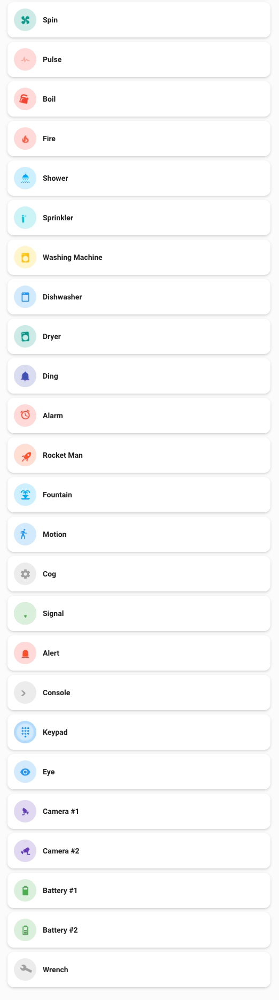
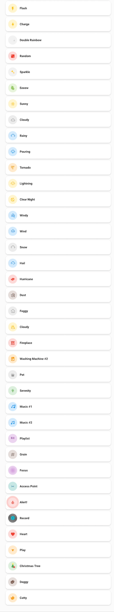

# Animation <!-- {docsify-ignore-all} -->

## Full Lovelance

Import the [animation-full.yaml](animation-full.yaml)

### Animation 01

Author: [rhysb](https://community.home-assistant.io/u/rhysb) | [HA Community](https://community.home-assistant.io/t/mushroom-cards-build-a-beautiful-dashboard-easily/388590/3240?u=d0doooh)

#### [Lovelance](animation-01.yaml) | [Cards](animation-01.md)

## Animation 02

Author: [rhysb](https://community.home-assistant.io/u/rhysb) | [HA Community](https://community.home-assistant.io/t/mushroom-cards-build-a-beautiful-dashboard-easily/388590/3256?u=d0doooh)

#### [Lovelance](animation-02.yaml) | [Cards](animation-02.md)

## Animation 03

Author: [rhysb](https://community.home-assistant.io/u/rhysb) | [HA Community](https://community.home-assistant.io/t/mushroom-cards-build-a-beautiful-dashboard-easily/388590/3272?u=d0doooh)

#### [Lovelance](animation-03.yaml) | [Cards](animation-03.md)

## Animation 04

Placeholder

## Animation 05

Placeholder
